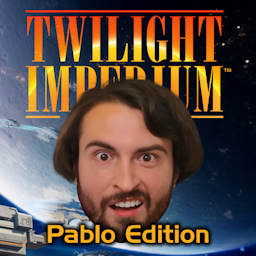

# TI4-PabloPatch (Tabletop Simulator) 🎭

Ein grafischer Mod-Patch für die **Twilight Imperium IV** Implementation im Tabletop Simulator. Dieser Patch ersetzt diverse Texturen und Anführer-Gesichter durch das "Pablo"-Design.

## ✨ Features
* **Custom TTS Textures:** Speziell optimierte Bilddateien für den Import in TTS.
* **Pablo-fied Factions:** Ersetzt die Standard-Artworks der Fraktionsbögen und Karten.

## 🚀 Installation (TTS)
1. **Repository klonen oder ZIP laden:** Lade diesen Ordner herunter.
2. **Dateien verschieben:** Kopiere die Bilder in deinen TTS-Cache oder lade sie direkt in deine Cloud hoch.
   - Pfad meistens: `Documents\My Games\Tabletop Simulator`

---
*Hinweis: Dies ist ein Fan-Projekt für die TTS-Community.*